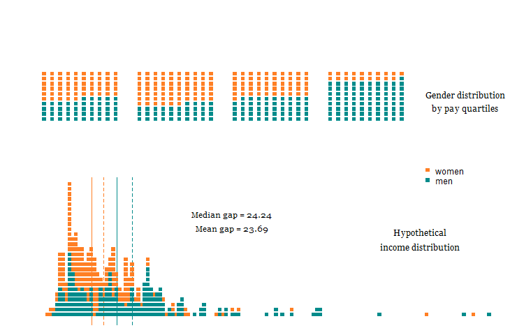

## Don't mind the gap

This is the code used to illustrate and animate the [**Don't mind the gap**]() blog post, published on the OIPA blog 4.4.2018. 

------

*The gender pay gap is not a good measure of gender discrimination. The attention it is being given is disproportionate and misleading. If it leads to companies gaming it, its effects could be extremely counterproductive. It might improve for reasons that have nothing to do with improving the lot of women, or improvements in it might come at the expense of much more deprivileged groups in our society. On balance the introduction of mandatory reporting is probably harmful.*

------

In the post I discuss:

*	People confuse the gender pay gap with unequal pay;
*	The gender pay gap is an artefact of forces other than gender discrimination, specifically labour force participation rates;
*	There is a danger of the gap becoming victim of Goodhart’s law: when the measure becomes the target and therefore ceases to be a good measure. 
*	Other unintended consequences.

But you should read it [here]().

------

The code here is for a few charts, and this gif:

------

The code should all be selfcontained, but has no error handling. Run with the following line:

`source("code/02_plotting.R")`